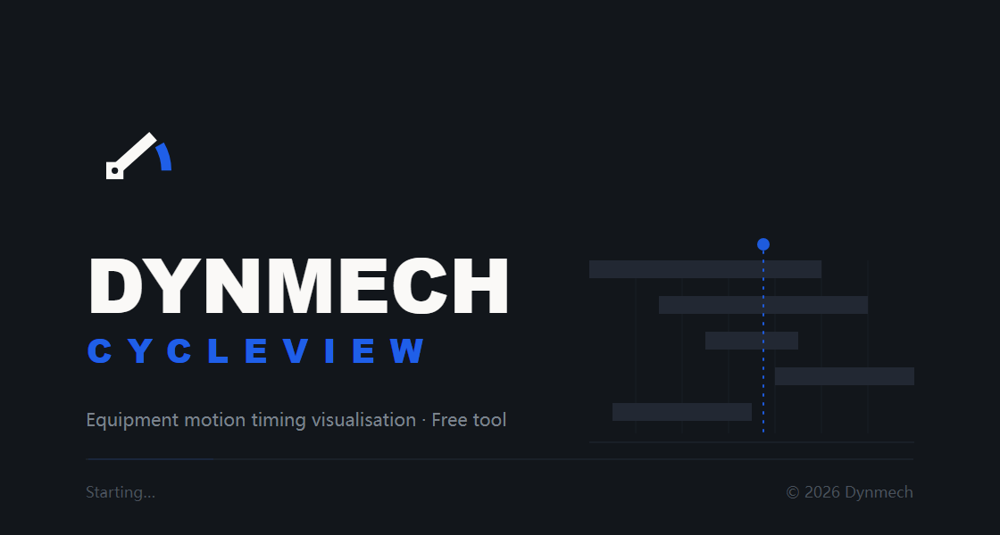

# DynMech CycleView — Equipment Motion Timing

[简体中文](README.md) · [繁體中文](README.zh-TW.md) · **English**

[](LICENSE)
[](https://www.dynmech.com/zh-hans/download/)
[](https://www.dynmech.com/zh-hans/cycleview/)
[](https://www.dynmech.com)

Website & downloads: **[dynmech.com](https://www.dynmech.com/en/cycleview/)**


> Free tool. No licence key. Fully offline.
> Formerly METS (Mechanism Timing Simulation); renamed CycleView for the DynMech release.

**CycleView turns a machine's mechanism timing into an animated chart.**
Time runs along X, mechanisms down Y. Each module starts at its own column and
advances one cell at a time at its own pace. One look tells you what collides in
time, what is sitting idle, and which stretch owns the bottleneck.

Fill in a CSV, hit space, export it into the bid. That's the whole tool.



## What it's for

| Situation | The usual approach | With CycleView |
|---|---|---|
| Estimating cycle time while quoting a machine | Hand-drawn Gantt chart in Excel | Fill the CSV, play it, look at the longest bar |
| Balancing a line | Gut feel plus a stopwatch on the floor | Every station side by side — overlaps and idle gaps visible |
| Bids and design reviews | 3D screenshots plus a verbal explanation | Export MP4 or PNG straight into the document |
| Training new engineers | Standing next to the machine, pointing | One chart that explains how the whole machine moves |

## Scope and limits (read this first)

CycleView works **in the time dimension only**. It performs no geometric
interference checking, no kinematic or dynamic calculation, and no verification
of safety functions.

> **Bars that don't overlap in time does not mean the mechanisms won't collide in space.**

It sits **upstream** of 3D motion simulation: settle *when* things move here,
then work out *how* they move in [DynMech Motion](https://dynmech.com). Every
conclusion must be reviewed by a qualified engineer before production use — see
[EULA.md](EULA.md).

## Features

- 📊 **CSV import** — five columns describe a machine's whole timing
- 🎬 **Playback** — timeline scrubbing, frame stepping, speed control, looping
- 🎨 **Timing grid** — grouped by stage, with multiple sequential actions per module
- 🌏 **Four languages** — Simplified Chinese, Traditional Chinese, English, Japanese
- 🎥 **MP4 export** — frame-accurate H.264 at 24 / 30 / 60 fps
- 📄 **PDF report** — vector chart plus parameter table, ready to send to someone without CycleView
- 💾 **Other exports** — Excel, PNG, CSV, project JSON
- ⚡ **Keyboard shortcuts** — every action reachable without the mouse
- 🔄 **Undo / redo** — full edit history
- ⚙️ **Preferences** — configurable interface and animation parameters

### About MP4 export

It is **not a screen recording**. Every frame is re-rendered offscreen at an
exact millisecond offset and encoded to H.264 with WebCodecs. Which means:

- video length depends only on your data — not on machine speed, and not on the
  playback rate showing on screen;
- frames come from the same rendering code the canvas uses, so the video cannot
  disagree with the interface;
- the finished chart is held for one extra second, so presentations and
  screenshots land on the complete picture;
- oversized canvases are scaled to fit within 3840px, with even dimensions as
  H.264 requires.

### About the PDF report

The PDF is the only export that is a **finished deliverable**. CSV and project
files are only useful to someone running CycleView; PNG and MP4 are raw material
you paste into a deck. A PDF goes straight to the customer, the boss, or the
downstream shop.

Two pages (the table continues onto further pages when there are many actions):

- **Page 1 — timing chart**, A3 landscape vector, sharp at any print size
- **Page 2 — parameter table**: start cell, cell count and ms per cell for every
  action, plus the **start and end times computed from the timing model**. That
  is what the report adds over the source CSV: the CSV says "12 cells at 80ms",
  the report says "runs from 800ms to 1760ms"
- **Running header** with project, cycle time, module count and export
  timestamp; **running footer** with attribution and page numbers

The whole file is vector, with selectable, searchable text — Ctrl+F finds a
module name — and not a single bitmap. CJK renders from system fonts, so nothing
has to be embedded.

## CSV format

| Column | Meaning |
|---|---|
| `module` | Mechanism module name |
| `action` | Description of the action |
| `startPosition` | Starting cell (phase / delay) |
| `moveCount` | Number of cells traversed (action duration) |
| `intervalTime` | Milliseconds per cell (speed) |
| `stage` | Stage this action belongs to (optional) |

```csv
module,action,startPosition,moveCount,intervalTime,stage
Feeder_1,material_loading,0,25,100,A
Feeder_1,vibration_control,0,20,120,A
Conveyor_1,belt_operation,10,30,100,A
```

`sample-data/` ships ten ready-made examples — assembly station, conveyor,
packaging line, robotic arm, large production line, synchronised motion, plus a
deliberately malformed file for testing error handling.

## Shortcuts

| Action | Key | Action | Key |
|------|--------|------|--------|
| Play / pause | `Space` | Import CSV | `Ctrl/Cmd + Shift + O` |
| Stop | `Escape` | Export | `Ctrl/Cmd + Shift + E` |
| Reset | `Home` | Undo | `Ctrl/Cmd + Z` |
| Next frame | `→` | Redo | `Ctrl/Cmd + Shift + Z` |
| Previous frame | `←` | Loop playback | `Ctrl/Cmd + L` |
| Faster / slower | `+` / `-` | Toggle crosshair | `C` |

## Development

Requires Node.js 18+.

```bash
npm install
npm run dev
```

Build:

```bash
npm run build
```

Per-platform packages: `npm run dist:win` / `dist:mac` / `dist:linux`.
Supports macOS (Intel & Apple Silicon), Windows x64, Linux x64.

### Code layout worth knowing

- `src/lib/timingModel.ts` — the timing model. When each action starts is
  computed once, here; the timeline, the canvas and the MP4 exporter all read
  from it.
- `src/lib/canvasRenderer.ts` — the drawing code. Screen and video both call
  `renderTimingFrame`, so the two cannot drift apart.
- `src/lib/drawSurface.ts` — drawing backends: Canvas for screen and video,
  SVG for the PDF.
- `src/services/videoExport.ts` — WebCodecs encoding plus mp4-muxer.
- `src/services/pdfExport.ts` — builds the report HTML; the PDF itself comes
  from `webContents.printToPDF` in the main process (Chromium's print pipeline,
  so CJK needs no embedded font).

## Stack

Electron + React + TypeScript, built with Vite. Zustand for state,
Tailwind CSS + Radix UI, i18next for the four languages, Canvas for the timing
grid, WebCodecs + mp4-muxer for video export, and Chromium's print pipeline for
PDF.

## Known issues

- Past roughly 30–40 modules the grid becomes hard to read; split the chart
  using the `stage` column.
- Project files now use `.cvp` instead of `.mts`; the open dialog still reads
  legacy `.mts` files.

## Brand assets

`assets/brand/` holds the DynMech mark, the lockups, and the splash card in four
languages. The splash source is [`assets/splash.html`](assets/splash.html) (SVG,
1120×600 at 2x) — edit copy or re-export the PNGs from there. The reasoning
behind the typeface choice is in
[`assets/brand/fonts/README.md`](assets/brand/fonts/README.md).

## Licence

**Free software. No licence key, no device limit, commercial use permitted.**

| | |
|---|---|
| Source code | [Apache License 2.0](LICENSE) · [NOTICE](NOTICE) |
| Binaries | [Terms of use — EULA.md](EULA.md) |

Runs fully offline. Makes no network requests and collects no data.

---

DynMech · [dynmech.com](https://dynmech.com)
Derived from METS (Mechanism Timing Simulation) published by Motionforge.
