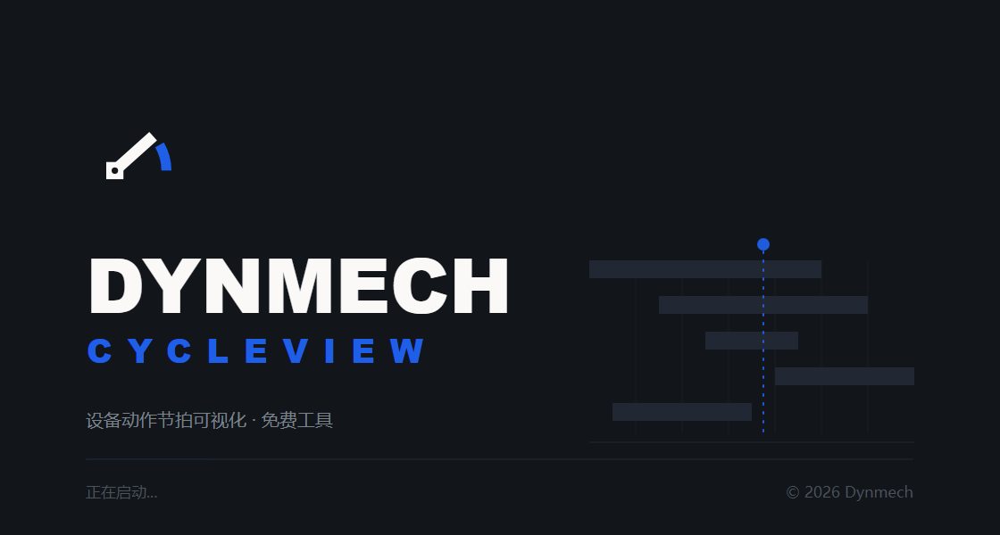

# DynMech CycleView — 设备动作节拍可视化

**简体中文** · [繁體中文](README.zh-TW.md) · [English](README.en.md)

[](LICENSE)
[](https://www.dynmech.com/zh-hans/download/)
[](https://www.dynmech.com/zh-hans/cycleview/)
[](https://www.dynmech.com)

官网与下载：**[dynmech.com](https://www.dynmech.com/zh-hans/cycleview/)**


> 免费工具,无需授权码,完全离线。
> 前身为 METS(Mechanism Timing Simulation),自 DynMech 发行起更名为 CycleView。

**CycleView 把一台设备各机构的动作时序画成一张会动的节拍图。**
X 轴是时间,Y 轴是机构模块;每个模块从自己的起始格开始,按自己的节拍逐格推进。
一眼就能看出:谁和谁撞了、谁在空等、整个循环的瓶颈在哪一段。

填一张 CSV,按空格键播放,导出进标书。就这么多。



## 它解决什么问题

| 场景 | 现在的做法 | 用 CycleView |
|---|---|---|
| 非标设备方案期估节拍 | Excel 手画甘特图 | 填 CSV → 播放 → 看最长那条带子 |
| 产线节拍平衡 | 拍脑袋 + 现场掐表 | 各工站并排看重叠与空等 |
| 投标 / 方案汇报 | 3D 截图 + 口头解释 | 导出 MP4 或 PNG 直接进标书 |
| 新人培训 | 站在机器旁边讲 | 一张图讲清整机怎么动 |

## 能力边界(请先读这一节)

CycleView **只处理时间维度**。它不做几何干涉检查,不做运动学与动力学计算,
不做安全功能验证。

> **时序图上没有重叠,不代表机构在空间上不会碰撞。**

它是 3D 运动仿真的**上游**工具——先把"什么时候动"排清楚,再去
[DynMech Motion](https://dynmech.com) 里算"具体怎么动"。所有结论须由工程人员
复核后方可用于生产,详见 [EULA.md](EULA.md)。

## 功能

- 📊 **CSV 导入** — 五列搞定一台设备的节拍描述
- 🎬 **动画播放** — 时间轴控制、逐帧步进、变速、循环
- 🎨 **节拍网格** — 按阶段(stage)分组,支持同一模块多段串行动作
- 🌏 **四语界面** — 简体中文、繁體中文、English、日本語
- 🎥 **MP4 导出** — 帧精确的 H.264 视频,可选 24 / 30 / 60 fps
- 📄 **PDF 报告** — 矢量节拍图 + 参数表,可直接发给没装本软件的人
- 💾 **其他导出** — Excel、PNG、CSV、项目 JSON
- ⚡ **快捷键** — 全功能键盘操作
- 🔄 **撤销 / 重做** — 完整编辑历史
- ⚙️ **偏好设置** — 界面与动画参数可自定义

### 关于 MP4 导出

导出的**不是录屏**。CycleView 会按精确的毫秒偏移把每一帧离屏重画一遍,
再用 WebCodecs 编码成 H.264。所以:

- 视频长度只取决于数据,与机器快慢、与界面上的播放倍速无关;
- 画面用的是和屏幕上完全相同的渲染代码,不会出现"视频和界面不一样";
- 动画结束后会多停 1 秒,方便截图和汇报时停在完整的节拍图上;
- 大画布会自动等比缩到 3840px 以内,尺寸取偶数(H.264 要求)。

### 关于 PDF 报告

PDF 是唯一一个**成品**导出:CSV 和项目文件只有装了 CycleView 的人能用,PNG 和 MP4
是要贴进 PPT 的素材,而 PDF 可以直接发给客户、老板、下游工厂。

一份报告两页(参数多时表格自动续页):

- **第 1 页 节拍图** — A3 横版矢量图,打印到任意尺寸都锐利
- **第 2 页 参数表** — 每个动作的起始格、格数、每格 ms,外加**从时序模型算出的
  开始 / 结束时刻**。这是报告比原始 CSV 多出来的东西:CSV 说"走 12 格 × 80ms",
  报告说"从 800ms 跑到 1760ms"
- **每页页眉** 项目名 · 总节拍 · 机构数 · 导出时间,**页脚** 出处与页码

整份文件是矢量的,文字可选可搜索(Ctrl+F 能搜到机构名),没有一张位图。
中日文由系统字体渲染,不需要嵌入字体。

## CSV 数据格式

| 字段 | 含义 |
|---|---|
| `module` | 机构模块名称 |
| `action` | 动作说明 |
| `startPosition` | 起始格(相位 / 延迟) |
| `moveCount` | 移动格数(动作时长) |
| `intervalTime` | 每格毫秒数(速度) |
| `stage` | 所属阶段(可选) |

```csv
module,action,startPosition,moveCount,intervalTime,stage
Feeder_1,material_loading,0,25,100,A
Feeder_1,vibration_control,0,20,120,A
Conveyor_1,belt_operation,10,30,100,A
```

`sample-data/` 下有 10 组现成示例:装配站、输送线、包装线、机械臂、大型产线、
同步运动,以及一份用于测试报错的异常数据。

## 快捷键

| 功能 | 快捷键 | 功能 | 快捷键 |
|------|--------|------|--------|
| 播放 / 暂停 | `空格` | 导入 CSV | `Ctrl/Cmd + Shift + O` |
| 停止 | `Escape` | 导出 | `Ctrl/Cmd + Shift + E` |
| 重置 | `Home` | 撤销 | `Ctrl/Cmd + Z` |
| 下一帧 | `→` | 重做 | `Ctrl/Cmd + Shift + Z` |
| 上一帧 | `←` | 循环播放 | `Ctrl/Cmd + L` |
| 加速 / 减速 | `+` / `-` | 切换十字线 | `C` |

## 开发

需要 Node.js 18+。

```bash
npm install
npm run dev
```

构建:

```bash
npm run build
```

分平台产物:`npm run dist:win` / `dist:mac` / `dist:linux`。
支持 macOS(Intel & Apple Silicon)、Windows x64、Linux x64。

### 代码结构要点

- `src/lib/timingModel.ts` — 时序模型。每个动作什么时候开始,只在这里算一次,
  时间轴、画布和 MP4 导出都从这里取值。
- `src/lib/canvasRenderer.ts` — 绘图。屏幕和视频调用同一个 `renderTimingFrame`,
  两者不可能画得不一样。
- `src/lib/drawSurface.ts` — 绘图后端。Canvas 用于屏幕和视频,SVG 用于 PDF。
- `src/services/videoExport.ts` — WebCodecs 编码 + mp4-muxer 封装。
- `src/services/pdfExport.ts` — 报告 HTML;实际出 PDF 走主进程的
  `webContents.printToPDF`(Chromium 打印管线,中日文零字体嵌入)。

## 技术架构

Electron + React + TypeScript,Vite 构建,Zustand 管状态,
Tailwind CSS + Radix UI,i18next 四语,Canvas 渲染节拍网格,
WebCodecs + mp4-muxer 做视频导出,Chromium 打印管线出 PDF。

## 已知问题

- 模块数超过约 30~40 个后,节拍网格的可读性会明显下降,建议用 `stage` 分组分屏。
- 项目文件扩展名已由 `.mts` 改为 `.cvp`;打开对话框仍可读取旧的 `.mts` 文件。

## 品牌资源

`assets/brand/` 下有 DynMech 标识、锁定组合与四语开机画面。
开机画面源文件是 [`assets/splash.html`](assets/splash.html)(SVG,1120×600 @2x),
改文案或重新导出 PNG 都从它出发;字体选型的来龙去脉见
[`assets/brand/fonts/README.md`](assets/brand/fonts/README.md)。

## 授权

**本软件免费,无需授权码,无台数限制,可用于商业环境。**

| | |
|---|---|
| 源代码 | [Apache License 2.0](LICENSE) · [NOTICE](NOTICE) |
| 可执行程序 | [使用条款 EULA.md](EULA.md) |

完全离线运行,不发起任何网络请求,不采集任何数据。

---

DynMech · [dynmech.com](https://dynmech.com)
派生自 Motionforge 发布的 METS(Mechanism Timing Simulation)。
