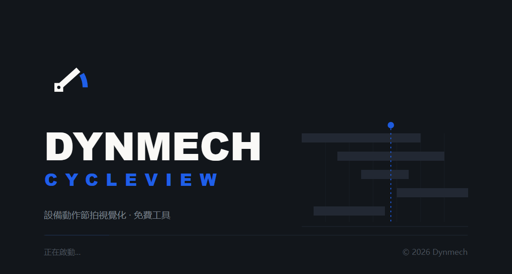

# DYNMECH CycleView — 設備動作節拍視覺化

[简体中文](README.md) · **繁體中文** · [English](README.en.md)

[](LICENSE)
[](https://www.dynmech.com/zh-hans/download/)
[](https://www.dynmech.com/zh-hans/cycleview/)
[](https://www.dynmech.com)

官網與下載：**[dynmech.com](https://www.dynmech.com/zh-hant/cycleview/)**


> 免費工具,無需授權碼,完全離線。
> 前身為 METS(Mechanism Timing Simulation),自 DYNMECH 發行起更名為 CycleView。

**CycleView 把一台設備各機構的動作時序畫成一張會動的節拍圖。**
X 軸是時間,Y 軸是機構模組;每個模組從自己的起始格開始,按自己的節拍逐格推進。
一眼就能看出:誰和誰撞了、誰在空等、整個循環的瓶頸在哪一段。

填一張 CSV,按空白鍵播放,導出進標書。就這麼多。



## 它解決什麼問題

| 場景 | 現在的做法 | 用 CycleView |
|---|---|---|
| 非標設備方案期估節拍 | Excel 手畫甘特圖 | 填 CSV → 播放 → 看最長那條帶子 |
| 產線節拍平衡 | 憑經驗 + 現場計時 | 各工站並排看重疊與空等 |
| 投標 / 方案簡報 | 3D 截圖 + 口頭說明 | 導出 MP4 或 PDF 直接進標書 |
| 新人訓練 | 站在機器旁邊講 | 一張圖講清整機怎麼動 |

## 能力邊界(請先讀這一節)

CycleView **只處理時間維度**。它不做幾何干涉檢查,不做運動學與動力學計算,
不做安全功能驗證。

> **時序圖上沒有重疊,不代表機構在空間上不會碰撞。**

它是 3D 運動模擬的**上游**工具——先把「什麼時候動」排清楚,再去
[DYNMECH Motion](https://dynmech.com) 裡算「具體怎麼動」。所有結論須由工程人員
複核後方可用於生產,詳見 [EULA.md](EULA.md)。

## 功能

- 📊 **CSV 匯入** — 五欄搞定一台設備的節拍描述
- 🎬 **動畫播放** — 時間軸控制、逐格步進、變速、循環
- 🎯 **跟隨播放** — 視窗自動捲動並按需縮放,始終把正在繪製的格子留在畫面裡
- 🎨 **節拍網格** — 按階段(stage)分組,支援同一模組多段串行動作
- 🌏 **五語介面** — 簡體中文、繁體中文、English、日本語、한국어
- 🎥 **MP4 導出** — 把跟隨播放錄成 H.264 影片,不含側邊欄,可選解析度、速率與影格率
- 📄 **PDF 報告** — 向量節拍圖 + 參數表,可直接發給沒裝本軟體的人
- 💾 **CSV 導出** — 參數表寫回 CSV,可帶串行動作的計算起始格
- ⚡ **快捷鍵** — 全功能鍵盤操作
- 🔄 **復原 / 重做** — 完整編輯歷史
- ⚙️ **偏好設定** — 介面與動畫參數可自訂

### 關於 MP4 導出

導出的**不是螢幕錄影**。CycleView 會按精確的毫秒偏移把每一影格離屏重畫一遍,
再用 WebCodecs 編碼成 H.264。所以:

- 影片長度只取決於資料,與機器快慢、與介面上的播放倍速無關;
- 畫面用的是和螢幕上完全相同的算圖程式碼,不會出現「影片和介面不一樣」;
- 動畫結束後會多停 1 秒,方便截圖和簡報時停在完整的節拍圖上;
- 大畫布會自動等比縮到 3840px 以內,尺寸取偶數(H.264 要求)。

### 關於 PDF 報告

PDF 是唯一一個**成品**導出:CSV 只有裝了 CycleView 的人能用,MP4
是要貼進簡報的素材,而 PDF 可以直接發給客戶、主管、下游工廠。

一份報告兩頁(參數多時表格自動續頁):

- **第 1 頁 節拍圖** — A3 橫版向量圖,列印到任意尺寸都銳利
- **第 2 頁 參數表** — 每個動作的起始格、格數、每格 ms,外加**從時序模型算出的
  開始 / 結束時刻**。這是報告比原始 CSV 多出來的東西:CSV 說「走 12 格 × 80ms」,
  報告說「從 800ms 跑到 1760ms」
- **每頁頁首** 專案名 · 總節拍 · 機構數 · 導出時間,**頁尾** 出處與頁碼

整份檔案是向量的,文字可選可搜尋(Ctrl+F 能搜到機構名),沒有一張點陣圖。
中日文由系統字體算圖,不需要嵌入字體。

## CSV 資料格式

| 欄位 | 含義 |
|---|---|
| `module` | 機構模組名稱 |
| `action` | 動作說明 |
| `startPosition` | 起始格(相位 / 延遲) |
| `moveCount` | 移動格數(動作時長) |
| `duration` | 每格毫秒數(速度)。舊欄位名 `intervalTime` 仍可識別 |
| `stage` | 所屬階段(選填) |

```csv
module,action,startPosition,moveCount,duration,stage
Feeder_1,material_loading,0,25,100,A
Feeder_1,vibration_control,0,20,120,A
Conveyor_1,belt_operation,10,30,100,A
```

`sample-data/` 下有 10 組現成範例:裝配站、輸送線、包裝線、機械手臂、大型產線、
同步運動,以及一份用於測試報錯的異常資料。

## 快捷鍵

| 功能 | 快捷鍵 | 功能 | 快捷鍵 |
|------|--------|------|--------|
| 播放 / 暫停 | `空白鍵` | 匯入 CSV | `Ctrl/Cmd + Shift + O` |
| 停止 | `Escape` | 導出 | `Ctrl/Cmd + Shift + E` |
| 重置 | `Home` | 復原 | `Ctrl/Cmd + Z` |
| 下一影格 | `→` | 重做 | `Ctrl/Cmd + Shift + Z` |
| 上一影格 | `←` | 循環播放 | `Ctrl/Cmd + L` |
| 加速 / 減速 | `+` / `-` | 切換十字線 | `C` |

## 開發

需要 Node.js 18+。

```bash
npm install
npm run dev
```

也可以直接執行倉庫根目錄的啟動腳本:`start.cmd`(Windows)或 `./start.sh`(macOS / Linux)。
不帶參數時先建置生產包再用 Electron 開啟,與發行版行為一致;`start dev` 走 Vite 熱更新並開啟 DevTools;`start build` 只建置不啟動。

建置:

```bash
npm run build
```

分平台產物:`npm run dist:win` / `dist:mac` / `dist:linux`。
支援 macOS(Intel & Apple Silicon)、Windows x64、Linux x64。

### 程式結構要點

- `src/lib/timingModel.ts` — 時序模型。每個動作什麼時候開始,只在這裡算一次,
  時間軸、畫布和 MP4 導出都從這裡取值。
- `src/lib/canvasRenderer.ts` — 繪圖。螢幕和影片呼叫同一個 `renderTimingFrame`,
  兩者不可能畫得不一樣。
- `src/lib/drawSurface.ts` — 繪圖後端。Canvas 用於螢幕和影片,SVG 用於 PDF。
- `src/services/videoExport.ts` — WebCodecs 編碼 + mp4-muxer 封裝。
- `src/services/pdfExport.ts` — 報告 HTML;實際出 PDF 走主行程的
  `webContents.printToPDF`(Chromium 列印管線,中日文零字體嵌入)。

## 技術架構

Electron + React + TypeScript,Vite 建置,Zustand 管狀態,
Tailwind CSS + Radix UI,i18next 四語,Canvas 算圖節拍網格,
WebCodecs + mp4-muxer 做影片導出,Chromium 列印管線出 PDF。

## 已知問題

- 模組數超過約 30~40 個後,節拍網格的可讀性會明顯下降,建議用 `stage` 分組分屏。
- 專案檔副檔名已由 `.mts` 改為 `.cvp`;開啟對話框仍可讀取舊的 `.mts` 檔案。

## 品牌資源

`assets/brand/` 下有 DYNMECH 標識、鎖定組合與四語開機畫面。
開機畫面原始檔是 [`assets/splash.html`](assets/splash.html)(SVG,1120×600 @2x),
改文案或重新導出 PNG 都從它出發;字體選型的來龍去脈見
[`assets/brand/fonts/README.md`](assets/brand/fonts/README.md)。

## 授權

**本軟體免費,無需授權碼,無台數限制,可用於商業環境。**

| | |
|---|---|
| 原始碼 | [Apache License 2.0](LICENSE) · [NOTICE](NOTICE) |
| 可執行程式 | [使用條款 EULA.md](EULA.md) |

完全離線運行,不發起任何網路請求,不採集任何資料。

---

DYNMECH · [dynmech.com](https://dynmech.com)
衍生自 Motionforge 發布的 METS(Mechanism Timing Simulation)。
