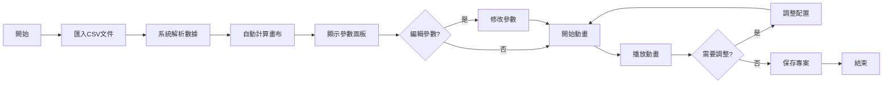

# 機構運動時序模擬系統 - 設計文檔

## 1. 系統概述

本系統是一個跨平台的桌面應用程式，基於網格的時序動畫模擬器，用於視覺化展示多個機構模組的運動時序關係。系統通過在網格畫布上進行著色動畫，直觀地展示各模組在時間軸上的運動狀態，並支援多種格式的匯出功能。

## 2. 技術棧

### 2.1 應用框架
- **Electron**：跨平台桌面應用框架，支援 macOS、Linux、Windows
- **Electron Builder**：應用打包和分發工具

### 2.2 前端框架
- **React 18+**：主要開發框架，提供組件化開發能力
- **TypeScript**：提供類型安全，提高代碼品質和開發效率

### 2.3 UI框架與樣式
- **Tailwind CSS**：快速構建響應式界面
- **Shadcn/ui**：提供高品質的UI組件
- **Lucide React**：圖標庫

### 2.4 狀態管理
- **Zustand**：輕量級狀態管理，管理全局狀態
- **Immer**：不可變數據更新，簡化狀態更新邏輯

### 2.5 數據處理與匯出
- **Papaparse**：CSV文件解析
- **ExcelJS**：Excel文件生成和匯出
- **jsPDF**：PDF文件生成
- **Canvas API**：圖像渲染和PNG匯出
- **FFmpeg.wasm**：瀏覽器端視頻編碼，生成MP4
- **Lodash**：數據處理工具函數

### 2.6 渲染技術
- **Canvas API**：高效繪製網格和動畫
- **OffscreenCanvas**：後台渲染提升性能
- **RequestAnimationFrame**：流暢的動畫控制

### 2.7 國際化工具
- **React-i18next**：React國際化框架
- **i18next**：國際化核心庫
- **i18next-browser-languagedetector**：自動檢測用戶語言
- **i18next-electron-fs-backend**：Electron文件系統後端

### 2.8 其他工具
- **React Hook Form**：表單處理
- **React Hotkeys Hook**：快捷鍵支持
- **Electron Store**：本地配置存儲

## 3. 核心概念

### 3.1 基本原理
- **網格畫布**：整個模擬區域由規則的網格組成
- **時序表示**：X軸代表時間進程，Y軸代表不同的機構模組
- **動畫原理**：通過從左到右逐格著色來表示時間推進和運動狀態

### 3.2 座標系統
- **X軸**：時間軸，每個格子代表一個時間單位
- **Y軸**：模組軸，每行對應一個機構模組
- **原點**：左上角為(0,0)

## 4. 系統架構

### 4.1 目錄結構
```
/
├── electron/            # Electron主程序
│   ├── main.ts         # 主程序入口
│   ├── preload.ts      # 預載腳本
│   └── menu.ts         # 應用菜單
├── src/
│   ├── components/      # React組件
│   ├── hooks/          # 自定義Hooks
│   ├── services/       # 業務邏輯服務
│   ├── stores/         # Zustand狀態管理
│   ├── types/          # TypeScript類型定義
│   ├── utils/          # 工具函數
│   ├── constants/      # 常量定義
│   └── locales/        # 國際化語言文件
├── assets/             # 靜態資源
├── dist/               # 構建輸出
└── release/            # 應用發布包
```

### 4.2 核心數據結構
```typescript
// 模組數據
interface ModuleData {
  id: string;
  moduleName: string;
  actionDescription: string;
  startX: number;
  moveCount: number;
  intervalTime: number;
}

// 畫布配置
interface CanvasConfig {
  cellWidth: number;
  cellHeight: number;
  showGrid: boolean;
  showRuler: boolean;
  gridColor: string;
  fillColor: string;
}

// 動畫狀態
interface AnimationState {
  isPlaying: boolean;
  currentFrame: number;
  speed: number;
  totalFrames: number;
}
```

## 5. 主要功能模組

### 5.1 資料導入模組
**功能描述**：
- 處理CSV檔案的導入和解析
- 資料驗證和錯誤處理
- 自動計算畫布尺寸

**CSV格式規範**：
| 欄位 | 名稱 | 說明 | 範例 |
|------|------|------|------|
| 1 | 模組 | 機構模組名稱 | 模組A |
| 2 | 動作說明 | 動作描述文字 | 水平移動 |
| 3 | 開始位置 | X軸起始座標 | 10 |
| 4 | 移動格數 | 向右移動的格子數 | 50 |
| 5 | 每格時間 | 每格運行時間(ms) | 100 |

### 5.2 畫布渲染模組
**核心功能**：
- 動態計算畫布尺寸
- 高效渲染網格系統
- 處理縮放和平移
- 優化重繪性能

**渲染流程**：
1. 清空畫布
2. 繪製網格（可選）
3. 繪製標尺（可選）
4. 繪製已著色格子
5. 更新動畫幀

### 5.3 動畫控制模組
**控制功能**：
- 播放/暫停/停止
- 速度調節（0.25x ~ 4x）
- 進度條拖動
- 單步執行
- 循環播放

**動畫算法**：
```javascript
// 偽代碼
function animate() {
  if (!isPlaying) return;
  
  const currentTime = getCurrentTime();
  modules.forEach(module => {
    const activeCell = calculateActiveCell(module, currentTime);
    if (activeCell) {
      fillCell(activeCell.x, activeCell.y, module.color);
    }
  });
  
  requestAnimationFrame(animate);
}
```

### 5.4 配置管理模組
**可配置項目**：
- 畫布設置
  - 格子尺寸（5~50像素）
  - 網格顏色
  - 背景顏色
  - 著色顏色方案
- 動畫設置
  - 默認播放速度
  - 自動播放
  - 循環模式
- 界面設置
  - 主題（亮色/暗色）
  - 語言（繁體中文/簡體中文/英文/日文）
  - 快捷鍵

## 6. 使用者介面設計

### 6.1 整體布局
```
┌─────────────────────────────────────────────────┐
│                   工具列 (Toolbar)               │
├─────────────┬───────────────────────────────────┤
│             │                                   │
│   參數面板   │          畫布區域                │
│  (250px寬)  │        (自適應寬度)              │
│             │                                   │
│  - CSV數據  │    - 網格顯示                    │
│  - 編輯功能 │    - 動畫渲染                    │
│  - 模組列表 │    - 縮放控制                    │
│             │                                   │
├─────────────┴───────────────────────────────────┤
│              時間軸控制區 (80px高)               │
│  [播放] [暫停] [停止] ────────────── [速度]    │
└─────────────────────────────────────────────────┘
```

### 6.2 工具列設計
- **檔案操作**：新建、開啟、儲存、匯入、匯出
- **編輯工具**：撤銷、重做、清空、重置
- **檢視選項**：縮放、全螢幕、網格開關、標尺開關
- **幫助資訊**：使用說明、快捷鍵、關於

### 6.3 參數面板
- **數據顯示**：表格形式顯示CSV數據
- **行高對齊**：每行高度與畫布格子高度一致
- **編輯功能**：雙擊單元格進行編輯
- **顏色指示**：每個模組分配不同顏色

### 6.4 響應式設計
- 最小視窗寬度：1024px
- 參數面板可摺疊
- 畫布區域自適應
- 移動端基本支持

### 6.5 國際化設計
- **支援語言**：繁體中文（預設）、簡體中文、英文、日文
- **語言切換**：即時切換，無需重啟
- **自動檢測**：根據系統語言自動選擇
- **文字方向**：支援RTL語言擴展
- **數字格式**：根據地區自動調整
- **日期時間**：本地化顯示格式

## 7. 功能菜單詳細說明

### 7.1 檔案菜單
| 功能 | 快捷鍵 | 說明 |
|------|--------|------|
| 新建專案 | Ctrl+N / Cmd+N | 清空當前專案，創建新專案 |
| 開啟專案 | Ctrl+O / Cmd+O | 載入已保存的專案文件(.mts) |
| 儲存專案 | Ctrl+S / Cmd+S | 保存當前專案 |
| 另存為 | Ctrl+Shift+S / Cmd+Shift+S | 以新名稱保存專案 |
| 匯入CSV | Ctrl+I / Cmd+I | 匯入CSV數據文件 |
| 匯出 | | 匯出子菜單 |
| ├─ 匯出Excel | Ctrl+Shift+E | 匯出為Excel檔案(.xlsx) |
| ├─ 匯出PDF | Ctrl+Shift+P | 匯出為PDF文檔 |
| ├─ 匯出PNG | Ctrl+Shift+I | 匯出當前畫面為PNG圖片 |
| └─ 匯出MP4 | Ctrl+Shift+M | 匯出動畫為MP4視頻 |
| 退出 | Ctrl+Q / Cmd+Q | 退出應用程式 |

### 7.2 編輯菜單
| 功能 | 快捷鍵 | 說明 |
|------|--------|------|
| 撤銷 | Ctrl+Z | 撤銷上一步操作 |
| 重做 | Ctrl+Y | 重做已撤銷的操作 |
| 編輯參數 | F2 | 進入參數編輯模式 |
| 清空畫布 | Delete | 清除所有著色 |
| 重置動畫 | Home | 將動畫重置到起始狀態 |

### 7.3 檢視菜單
| 功能 | 快捷鍵 | 說明 |
|------|--------|------|
| 放大 | Ctrl++ | 放大畫布顯示 |
| 縮小 | Ctrl+- | 縮小畫布顯示 |
| 適應視窗 | Ctrl+0 | 自動調整畫布大小 |
| 顯示網格 | Ctrl+G | 切換網格顯示 |
| 顯示標尺 | Ctrl+R | 切換標尺顯示 |
| 全螢幕 | F11 | 進入/退出全螢幕模式 |

### 7.4 動畫菜單
| 功能 | 快捷鍵 | 說明 |
|------|--------|------|
| 播放/暫停 | Space | 切換播放狀態 |
| 停止 | Esc | 停止動畫並重置 |
| 下一幀 | → | 單步前進 |
| 上一幀 | ← | 單步後退 |
| 速度設定 | Ctrl+Shift+S | 開啟速度設定對話框 |
| 循環播放 | Ctrl+L | 切換循環播放模式 |

## 8. 匯出功能詳細說明

### 8.1 Excel匯出 (.xlsx)
**匯出內容**：
- 工作表1：原始CSV數據
- 工作表2：時序分析表
- 工作表3：統計資訊（各模組運行時間、重疊分析等）

**格式特點**：
- 保留原始數據格式
- 添加條件格式化顯示時序
- 包含圖表展示

### 8.2 PDF匯出
**匯出選項**：
- 頁面方向：橫向/縱向
- 頁面大小：A4/A3/Letter
- 內容選擇：
  - 時序圖表
  - 數據表格
  - 統計報告
  - 專案資訊

**PDF結構**：
1. 封面頁：專案名稱、日期、描述
2. 時序視圖：完整的網格時序圖
3. 數據明細：模組參數表
4. 分析報告：時序分析結果

### 8.3 PNG圖片匯出
**匯出選項**：
- 解析度：1x、2x、3x、自定義
- 範圍：全畫布/當前視圖/選定區域
- 背景：透明/白色/自定義顏色
- 包含元素：網格/標尺/標籤

**圖片優化**：
- 自動裁剪空白區域
- 支援高DPI輸出
- 批量匯出多幀

### 8.4 MP4視頻匯出
**視頻參數**：
- 解析度：720p、1080p、4K、自定義
- 幀率：24fps、30fps、60fps
- 編碼：H.264/H.265
- 比特率：自動/手動設定

**匯出選項**：
- 速度：原速/加速/慢動作
- 時長：完整動畫/指定區間
- 附加元素：
  - 時間軸顯示
  - 進度指示器
  - 模組標籤
  - 水印（可選）

**視頻生成流程**：
1. 預覽設定
2. 逐幀渲染到OffscreenCanvas
3. FFmpeg編碼
4. 進度顯示
5. 預覽和保存

## 9. 跨平台支援

### 9.1 平台特定功能
**macOS**：
- 原生菜單欄整合
- Touch Bar支援
- 全螢幕模式
- 系統通知中心

**Windows**：
- 任務欄進度顯示
- 跳轉列表快速訪問
- 系統托盤支援
- Windows通知

**Linux**：
- 支援主流發行版（Ubuntu、Fedora、Debian）
- AppImage打包
- 系統托盤支援
- 桌面整合

### 9.2 安裝包格式
- **macOS**：.dmg、.pkg
- **Windows**：.exe（安裝版）、.zip（便攜版）
- **Linux**：.AppImage、.deb、.rpm

## 10. 工作流程

### 10.1 基本使用流程


### 10.2 動畫執行邏輯
1. **初始化階段**
   - 讀取所有模組數據
   - 計算總時間長度
   - 預處理動畫序列

2. **執行階段**
   - 根據當前時間計算活動格子
   - 並行處理多模組著色
   - 更新進度顯示

3. **結束處理**
   - 動畫完成回調
   - 狀態重置選項
   - 自動循環判斷

## 11. 性能優化策略

### 11.1 渲染優化
- **髒矩形重繪**：只重繪變化區域
- **圖層分離**：背景網格和動畫分層
- **批量渲染**：合併相同顏色的格子繪製
- **視窗裁剪**：只渲染可見區域
- **GPU加速**：利用硬體加速提升性能

### 11.2 數據優化
- **虛擬滾動**：大數據量時只渲染可見行
- **數據分頁**：分批載入大型CSV
- **緩存策略**：緩存計算結果
- **Worker線程**：Electron的主/渲染進程分離

### 11.3 動畫優化
- **幀率控制**：根據性能動態調整
- **預計算**：預先計算動畫路徑
- **Web Worker**：複雜計算移至後台
- **離屏渲染**：使用OffscreenCanvas提升性能

### 11.4 匯出優化
- **分段處理**：大文件分段生成
- **進度回饋**：即時顯示處理進度
- **記憶體管理**：及時釋放不用資源
- **並行處理**：多核心利用

## 12. 開發里程碑

### 第一階段：基礎架構（1-2週）
- [ ] Electron專案初始化
- [ ] 跨平台環境配置
- [ ] 基本窗口和菜單系統
- [ ] CSV導入功能實現
- [ ] 基礎畫布渲染

### 第二階段：核心功能（2-3週）
- [ ] 網格系統實現
- [ ] 著色邏輯開發
- [ ] 動畫引擎構建
- [ ] 播放控制實現
- [ ] 基本匯出功能（PNG）

### 第三階段：界面完善（1-2週）
- [ ] 完整UI實現
- [ ] 參數編輯功能
- [ ] 配置管理系統
- [ ] 快捷鍵支持
- [ ] 平台特定UI優化

### 第四階段：進階匯出（2週）
- [ ] Excel匯出功能
- [ ] PDF生成器
- [ ] MP4視頻編碼
- [ ] 批量匯出
- [ ] 匯出預覽

### 第五階段：優化與打包（1-2週）
- [ ] 性能優化
- [ ] 記憶體優化
- [ ] 安裝包製作
- [ ] 自動更新機制
- [ ] 測試和除錯

### 第六階段：發布準備（1週）
- [ ] 使用文檔編寫
- [ ] 多語言支援
- [ ] 應用簽名
- [ ] 商店上架準備
- [ ] 版本發布

## 13. 應用特性

### 13.1 檔案關聯
- 自動關聯 .mts 專案文件
- 雙擊開啟專案
- 拖放支援CSV匯入

### 13.2 自動更新
- 應用內更新檢查
- 背景下載更新
- 增量更新支援
- 版本回滾機制

### 13.3 資料安全
- 自動保存（可配置間隔）
- 崩潰恢復
- 專案備份
- 加密儲存（可選）

### 13.4 使用者偏好
- 記住窗口大小位置
- 最近開啟檔案
- 自定義快捷鍵
- 主題切換

## 14. 擴展功能規劃

### 14.1 短期擴展
- 多種著色模式（漸變、圖案、自定義圖標）
- 動畫軌跡顯示和預覽
- 簡單的碰撞檢測
- 基礎統計報表
- 時序對比功能
- 標註和註釋工具

### 14.2 長期規劃
- 3D視圖模式
- 多文件對比和合併
- 動畫腳本支持（JavaScript）
- REST API接口
- 插件系統
- 團隊協作功能
- 雲端同步

## 15. 國際化實施方案

### 15.1 語言文件結構
```
locales/
├── zh-TW/          # 繁體中文（預設）
│   ├── common.json
│   ├── menu.json
│   ├── dialog.json
│   └── error.json
├── zh-CN/          # 簡體中文
├── en/             # 英文
└── ja/             # 日文
```

### 15.2 國際化關鍵點
- **文字提取**：所有UI文字必須使用i18n函數
- **動態內容**：支援變數插值和複數處理
- **快捷鍵**：不同語言環境的快捷鍵本地化
- **數據格式**：CSV匯入匯出的編碼處理
- **字體支援**：確保各語言字體正確顯示

### 15.3 翻譯管理
- **翻譯鍵命名**：使用語義化的鍵名
- **缺失處理**：提供預設語言回退機制
- **版本控制**：追蹤翻譯文件變更
- **翻譯工具**：提供翻譯輔助工具

## 16. 注意事項與最佳實踐

### 15.1 開發注意事項
- 使用TypeScript確保類型安全
- 遵循React最佳實踐
- 保持組件職責單一
- 編寫單元測試和整合測試
- 注意Electron安全最佳實踐
- 避免主進程阻塞

### 15.2 用戶體驗
- 提供清晰的錯誤提示
- 支援撤銷/重做操作（Ctrl+Z/Y）
- 自動保存防止數據丟失
- 新手引導和工具提示
- 載入大文件時顯示進度
- 響應式設計適應不同螢幕

### 15.3 應用品質
- 應用簽名確保安全
- 崩潰報告收集
- 使用分析（可選關閉）
- 定期更新維護
- 多語言支援（i18n）
- 無障礙設計（a11y）

### 15.4 發布管道
- GitHub Releases
- 官方網站下載
- Mac App Store（macOS）
- Microsoft Store（Windows）
- Snap Store（Linux）

## 17. 系統需求

### 16.1 最低需求
- **作業系統**：
  - macOS 10.13+
  - Windows 10 (64-bit)
  - Ubuntu 18.04+ / Fedora 32+
- **硬體**：
  - CPU：雙核心 2GHz+
  - RAM：4GB
  - 儲存：200MB可用空間
  - 顯示：1024x768解析度

### 16.2 建議配置
- **硬體**：
  - CPU：四核心 2.5GHz+
  - RAM：8GB+
  - 儲存：500MB可用空間
  - 顯示：1920x1080解析度
  - GPU：支援硬體加速

## 18. 結語

本設計文檔為機構運動時序模擬系統提供了完整的跨平台桌面應用開發指南。通過Electron框架和現代化技術棧，系統將在macOS、Linux和Windows平台上提供一致的使用體驗，並支援多種格式的匯出功能。開發過程中應持續關注性能優化和用戶體驗，確保應用的專業性和易用性。